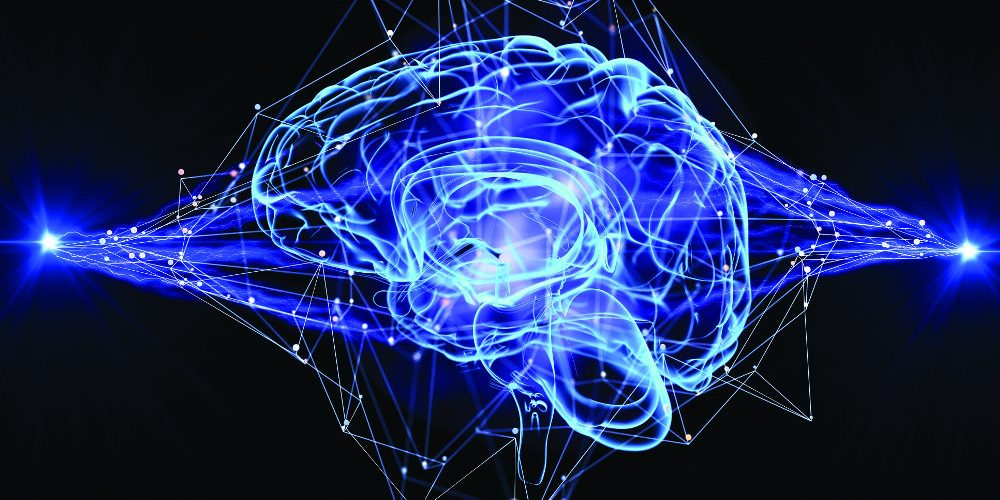
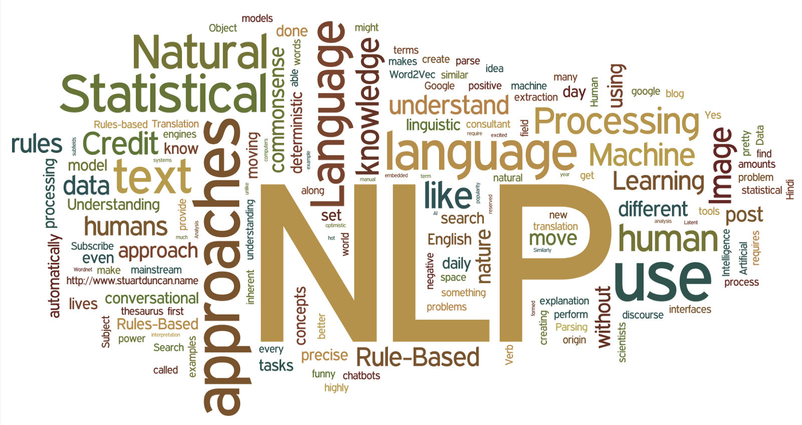

## What is Deep Learning?
Deep Learning is a subfield of machine learning concerned with algorithms inspired by the structure and function of the brain called artificial neural networks.

Deep learning architectures such as `deep neural networks`, `deep belief networks` and `recurrent neural networks` have been applied to fields including `computer vision`, `speech recognition`, `natural language processing`, `audio recognition`, `social network filtering`, `machine translation`, `bioinformatics`, `drug design`, `medical image analysis`, material inspection and board game programs, where they have produced results comparable to and in some cases superior to human experts.

## What is computer vision ?

Humans use their eyes and their brains to see and visually sense the world around them. Computer vision is the science that aims to give a similar, if not better, capability to a machine or computer.

Computer vision is concerned with the automatic extraction, analysis and understanding of useful information from a single image or a sequence of images(video). It involves the development of a theoretical and algorithmic basis to achieve automatic visual understanding.

The applications of computer vision are numerous and include:

* agriculture
* augmented reality
* autonomous vehicles
* biometrics
* character recognition
* forensics
* industrial quality inspection
* face recognition
* gesture analysis
* geoscience
* image restoration
* medical image analysis
* pollution monitoring
* process control
* remote sensing
* robotics
* security and surveillance
* transport

## What is Natural Language Processing (NLP) ?
Natural language processing (NLP) is the ability of a computer program to understand human language as it is spoken. NLP is a component of artificial intelligence (AI).

The development of NLP applications is challenging because computers traditionally require humans to "speak" to them in a programming language that is precise, unambiguous and highly structured, or through a limited number of clearly enunciated voice commands. Human speech, however, is not always precise -- it is often ambiguous and the linguistic structure can depend on many complex variables, including slang, regional dialects and social context.

## Contents

#### 1.[Scale Image Pixel Data](Scale_Image_Pixel_Data_for_Deep_Learning.ipynb)
#### 2.[A Gentle Guide to Deal with Text Data](a_gentle_guide_to_deal_with_text_data.ipynb)
